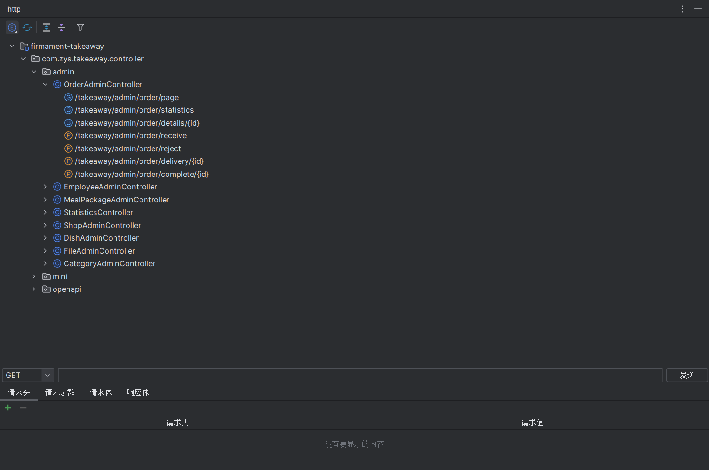
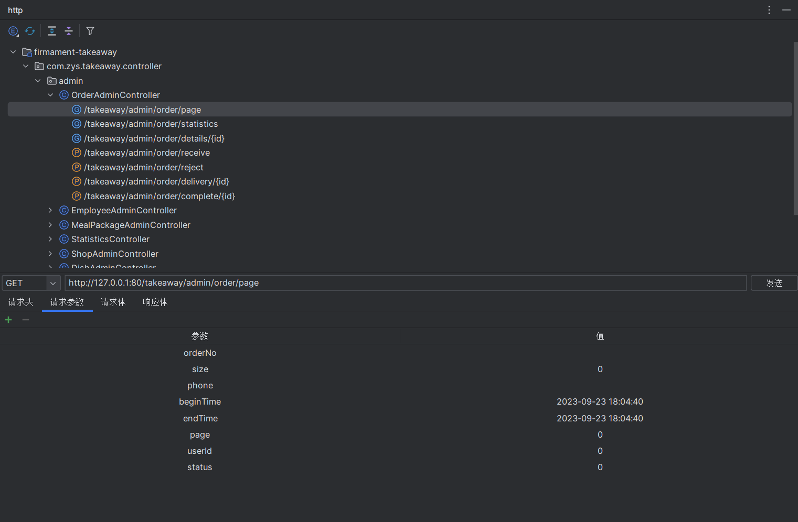
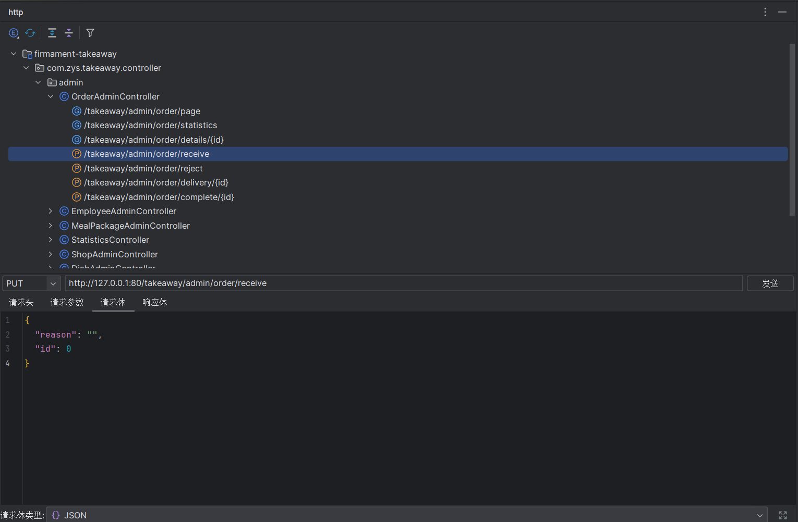
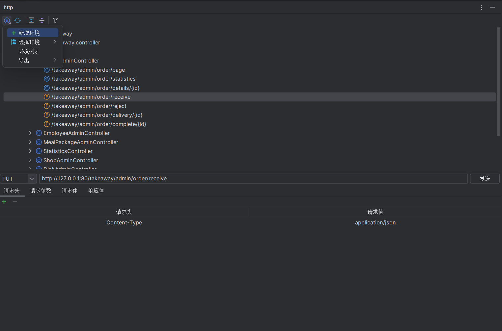

# Api Tool

<a href="https://gitee.com/zhou-sheng1/http">Gitee</a>|
<a href="https://github.com/15815162480/http">GitHub</a>

## Introduce

#### A request service development aid plugin.

1. Only Java language is supported.
2. Language Supported: English, Chinese.
3. Support for Spring annotation system (Spring MVC / Spring Boot).
4. Provides a regional display API interface.
5. Double-click a method node to jump directly to the corresponding method definition.
6. Configurable multiple environments.
7. The default environment is to read the ports in order of bootstrap.(properties, yaml, yml) and
   application.(properties, yaml, yml) priority.
8. The context-path will be bound in the method node.

## Feature

### Basic

1. Scans all classes decorated with @ Controller or @ RestController
   
2. Clicking on the method node will automatically fill in all the parameters on the method and jump to the corresponding
   panel.
    * if it has the path variable, it will be filled at the param
    * if it is body type, you can choose the content-type in text, xml, json
    * if the current env has other request header, them will be filled at the header
    * click /takeaway/admin/order/page
      
    * click /takeaway/admin/order/receive
      

### Multiple environments

1. Click the first icon of toolbar, that you can see the popup menu.
   
2. You can add a new Env in the popup menu ,or click the Env List to show all env, you can click the '+' icon to add a
   new Env too
3. Click the Env List to show all env, if you choose an env, you can edit or delete it. If deleting the default env, it
   will be created after clicking refresh icon
4. if you want to change the current env, you move the mouse to hover on the select env item, it will pop up all env and
   click the env you want to change

### Other

1. refresh
2. expand: if you choose a node in the tree, it only expands the chose node. If you not choose, it will expand all node.
3. collapse: Same as expanding
4. filter method: Filter out the request
5. toolTip: if your project has used for the swagger annotation(@Api/@Tag, @ApiOperation/@Operation), hovering the class
   node and method node will pop up the tip.
6. export: export the simple postman json data
7. right-click menu: if you click on the node, in addition to method nodes, all with the expanding operation, the method
   nodes have three operations, jump to method, copy full path and copy api
8. filter node: You can choose whether to show package nodes or class nodes