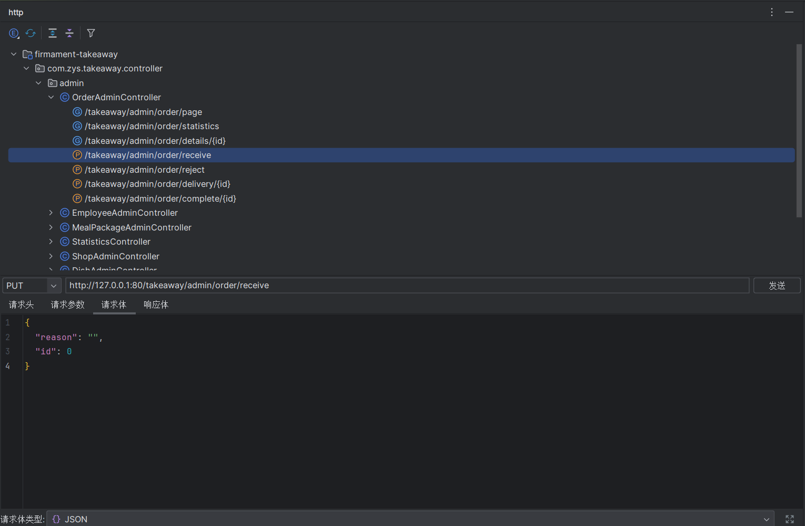
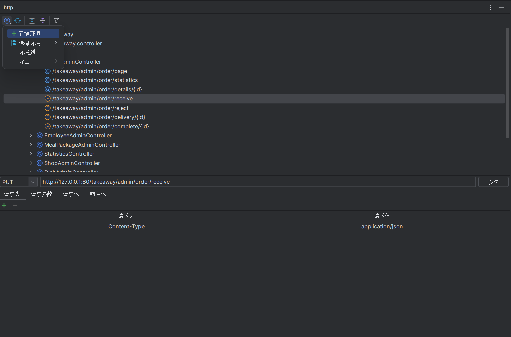

# Api Tool

<a href="https://gitee.com/zhou-sheng1/http">Gitee</a>|
<a href="https://github.com/15815162480/http">GitHub</a>

## 介绍
#### 一个请求服务开发辅助工具插件
1. 只支持 java 语言
2. 语言支持: 英语、中文
3. 支持 Spring 注解体系(Spring MVC / Spring Boot)
4. 提供了一块区域展示 API 接口
5. 双击方法结点直接跳转到对应的方法定义
6. 可配置多环境
7. 默认环境是按 bootstrap.(properties、yaml、yml)、application.(properties、yaml、yml) 优先级顺序读取其中的 port

## Feature
### Basic
1. 扫描所有被 @Controller/ @RestController 修饰的类
   
2. 单击方法结点会自动填充方法上的所有参数并跳转到相应的面板
    * 如果有路径变量，则它将填充在请求参数
    * 如果是请求体类型参数, 可以选择请求文本的类型: 文本、xml 和 json
    * 如果当前选中环境具有其他请求标头，则它们将会被填充在请求头标签页处
    * 点击 /takeaway/admin/order/page
      
    * 点击 /takeaway/admin/order/receive
      

### 多环境
1. 单击工具栏的第一个图标，可以看到弹出菜单。
   
2. 可以在弹出菜单中添加环境配置, 或者单击环境列表显示所有环境配置, 单击"+"图标添加新的环境配置
3. 单击环境列表以显示所有环境配置, 如果选中一个环境配置，则可以对其进行编辑或删除，如果删除默认环境, 在单击刷新图标后将重新创建.
4. 如果想更改当前环境, 将鼠标悬停在"选择环境"上, 它将弹出所有环境, 然后单击想要选中的环境

### 其它
1. 刷新
2. 展开: 如果您在树中选中一个节点，它只会展开选中节点。如果不选择，它将展开所有节点。
3. 收起: 与展开一致
4. 请求方式过滤: 过滤去想要的请求方式
5. 提示: 如果您的项目有使用 swagger 注解 (@Api/@Tag、@ApiOperation/@Operation)，则悬停在类节点和方法节点将弹出提示。
6. 导出: 导出简易的 postman json 数据
7. 右键菜单: 如果单击节点, 除了方法节点之外, 所有的扩展操作, 方法节点都有三个操作, 跳转到方法, 复制完整路径和复制 api

## 参考
部分代码参考 [RestfulTool](https://gitee.com/zys981029/RestfulTool)
